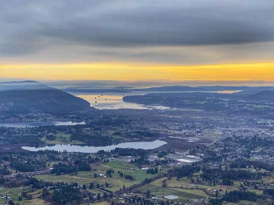

+++
title = "Eric's Bluff"
name = "Erics Bluff"
tags = ["Youbou", "H&F"]
kmlName = "Erics Bluff"
kmlFolder = "Youbou"
draft = false

+++
Hike to Chistopher Rock and then keep heading higher for another 10 minutes.  Faces south.  Not great in east wind.

## Gallery

  
  
  
  
  
  
