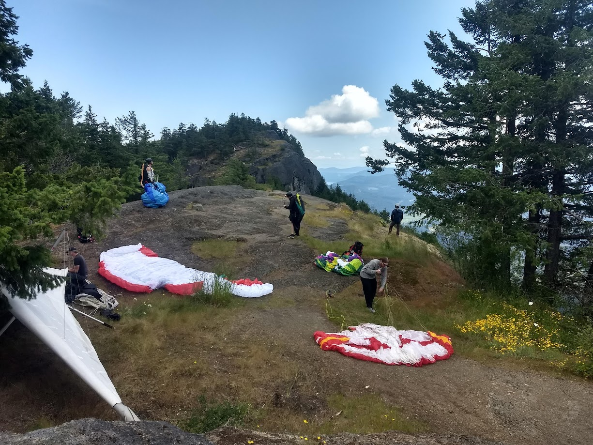
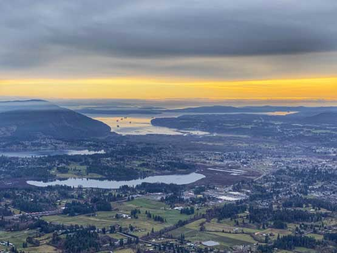

+++
title = 'Mount Prevost'
date = 2024-06-26T11:58:52-07:00
kmlName = "Mount Prevost - East"
kmlFolder = "Mount Prevost"
weight = 1
tags= ["H&F"]
heroStyle="basic"
draft = false
+++
## Intro
This is the main Site for south Vancouver island.   W, S and E east facing launches and a huge hay field to land in.  Watch out for the power lines.

## Gallery

  
  
  
  
  
  


## Airspace
Airspace around Vancouve Island is complicated.  Please study closely and consult locals before you try XC from Prevost.
* Glass G at Take off.  
* Class E at 3000
* Class C at 3500
* Before you cross Highway 1 or Highway 17 make sure you are clear on the relevant Airspace restrictions.